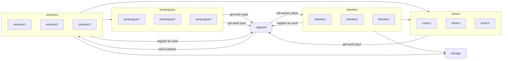

# ComputerCraft Tools for FTB
This is a repo of ComputerCraft programs to integrate together for FTB operations.

## Cfg-Store
This is an 'API' to hold distributed configuration. It will contain info like:
- Refuel Inventory Stations per dimension / task / turtle
- Program specific config maps (custom)
- Registration of worker ids per program for distributed discovery

## Lumberjack
This program will cut trees and replant them infinitely while storing the excess for the team.

## Miner
This program will quarry the configured area and exchange items for fuel with refuelers

## Refueler
This program will transport fuel from storage to the worker to allow them to keep doing their thing

## Retriever
This program will find workers and take their inventory back to storage
